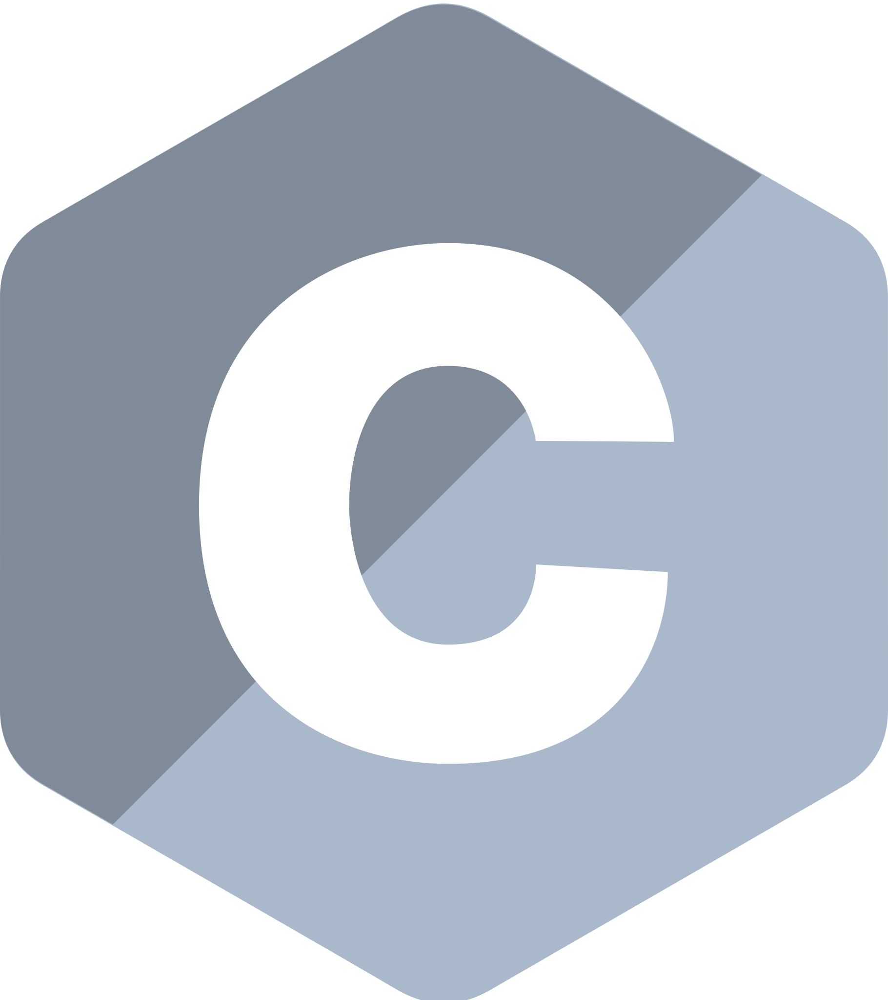

<h1 align="center">
  
</h1>

<h5 align="center">
  <code><a href="https://www.linkedin.com/in/anuj-kumar-yadav-592a24263/" title="LinkedIn Profile"> LinkedIn</a></code>
  <code><a href="https://leetcode.com/anuj__07/" title="Leetcode Profile"> Leetcode</a></code>
  <code><a href="https://www.codechef.com/users/anuj_yadav_12" title="Codechef"> Codechef</a></code>
  <code><a href="https://www.instagram.com/yadav_anuj007/" title="Instagram Profile"> Instagram</a></code>
</h5>
 

  <b>🚀 Full-Stack Developer | Problem Solver | Tech Enthusiast</b>
   
  🎓 Pursuing B.Tech in Computer Science & Engineering at IIIT Nagpur.
   
  💻 Passionate about designing scalable web applications, backend systems, and engaging UI/UX.
   
  ⚡ Love tackling complex algorithms, competitive coding, and open-source contributions.
   
  🛠️ Skilled in MERN, Django, REST APIs, and cloud-based architectures.
   
  📚 Built industry-grade projects like <b>Urban Cart</b> (E-commerce), <b>Social Hive</b> (Social Media), and <b>OpportuniTree</b> (Job Search Platform).
   
  💬 Let's connect and collaborate! Drop your queries <a href="https://github.com/anujyadav007/anujyadav007/issues" title="Issues">Here</a>
   
  📫 Reach me at: <a href="mailto:5845anuj@gmail.com">5845anuj@gmail.com</a>

<h2 align="center">🔥 Tech Stack & Tools 🔥</h2>
 

  <code></code>
  <code></code>
  <code></code>
  <code></code>
  <code></code>
  <code></code>
  <code></code>
  <code></code>
  <code></code>
  <code></code>
  <code></code>
  <code></code>

<h2 align="center">⚡ GitHub Stats ⚡</h2>
 

  

    
    </a>
    
    </a>
  

           
  

    
    </a>
  

   

  

<h2 align="center">👨‍💻 Featured Projects 👨‍💻</h2>
 

  
  

         

<h4 align="center">
  <a href="https://github.com/anujyadav007?tab=repositories" title="Show Repositories">🔎 Show More 🔍</a>
</h4>
